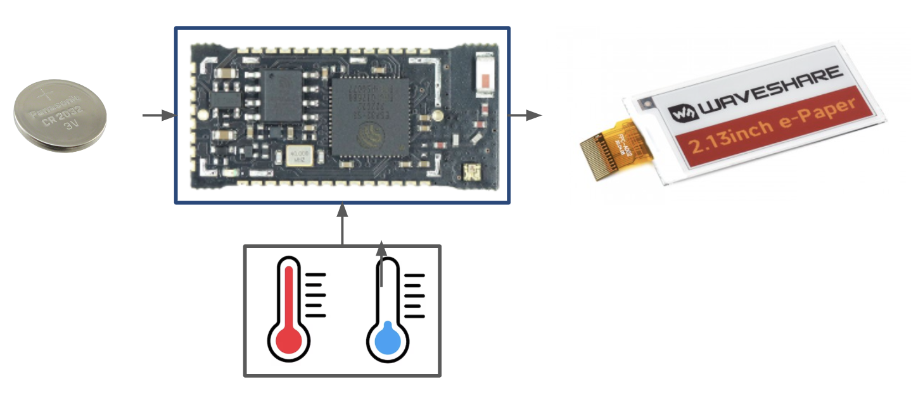

# Page Turner

Page Turner is a battery-powered ESP32 development board, with a lightweight set of sensors connected to an e-Paper display.

### Goals

- Low-power operation with 6+ mo on a coin-cell battery
  - 20 cycles per day
  - Min 4 cycles per day refresh to avoid burn-in
- Small form-factor
- Low cost BOM (will be distributed at tradeshows)
  - $15 @ ~100 qty cost target
- Temperature + humidity sensing and reporting
- Header pins available to extend the sensor suite to additional external sensors

### Extended Goals

- External DC power input
- Extended operating temperature (for outdoor weather monitoring)
- Physical enclosure

# Resources

Components Library: https://hub.allspice.io/AllSpice/AllSpice-Demo-Library

Reference Designs: https://github.com/unexpectedmaker/esp32s3

# Specifications

-  **Minimum operating temperature**: 0°C
-  **Maximum operating temperature**: 40°C
